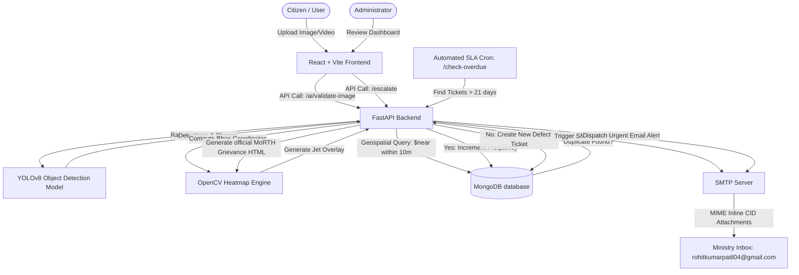

# 🤖 Smart Road & Civic System (AI Multi-Agent Pothole Tracker)

Smart Road & Civic System is an advanced, enterprise-grade civic administration platform engineered as a **Collaborative Multi-Agent AI Framework**. Instead of relying on a monolithic system, the platform orchestrates multiple specialized, autonomous AI agents to manage the entire lifecycle of a road hazard—from crowd-sourced detection and validation to conversational citizen support and automatic government escalation.

---

## 🤖 The Multi-Agent AI Framework

The system operates around three distinct, highly specialized AI agents that coordinate and pass data boundaries to manage civic accountability:

```
+-----------------------------------------------------------------------------------+
|                            MULTI-AGENT AI COORDINATION                            |
+-----------------------------------------------------------------------------------+
|                                                                                   |
|  [ 📷 Computer Vision Agent ]      [ 💬 Conversational Agent ]                    |
|             | (Detections)                          | (Interface Help)            |
|             v                                       v                             |
|    +------------------+                    +------------------+                   |
|    |  YOLOv8 Engine   |                    | Gemini 2.5 Flash |                   |
|    +------------------+                    +------------------+                   |
|             |                                       |                             |
|             +---------------> [ Central Orchestrator ] <------------+             |
|                                       |                                           |
|                                       v (Geospatial Aggr / Mongo DB)              |
|                             +--------------------+                                |
|                             |  SLA State Monitor |                                |
|                             +--------------------+                                |
|                                       |                                           |
|                                       v (21-Day SLA Breach Trigger)               |
|                           [ 🕒 Escalation Agent ]                                 |
|                                       |                                           |
|                                       v (SMTP Inline CID Grievance Dispatch)      |
|                           { Ministry Office Inbox }                               |
+-----------------------------------------------------------------------------------+
```

### 1. 📷 The Computer Vision Agent (YOLOv8 & OpenCV)
* **Objective:** Automates visual defect auditing and validation.
* **Core Mechanics:** Processes incoming multipart image/video streams or live MJPEG frames. It localizes potholes via object detection, evaluates severity using bounding box densities, and generates high-trust thermal heatmap overlays using OpenCV Jet-blending algorithm.
* **Orchestration Handoff:** Passes boundary boxes, calculated counts, and severity ratings to the Central Orchestrator.

### 2. 💬 The Conversational Assistant Agent (Gemini 2.5 Flash)
* **Objective:** Manages user support and guides citizens through platform operations.
* **Core Mechanics:** Operates with a sandboxed system context specifying pothole severity rules, IP Webcam pairing workflows, and coordinates usage. It maintains context-aware conversations recursively and resolves navigational questions on-demand.
* **Orchestration Handoff:** Converts user intentions into platform recommendations, guiding citizens to trigger the Computer Vision Agent or check map locations.

### 3. 🕒 The Escalation & Accountability Agent (Automated SLA Cron)
* **Objective:** Enforces public safety standards and local government accountability.
* **Core Mechanics:** An autonomous background worker that continuously scans MongoDB ticket states. It monitors SLA periods, detects unresolved defect tickets older than 21 days, automatically compiles MoRTH grievance letters, builds complex `MIMEMultipart("related")` packages, embeds raw/heatmap evidence as `MIMEImage` inline attachments, and dispatches them via Gmail SMTP TLS to the ministry inbox.
* **Orchestration Handoff:** Integrates with the central database to transition ticket states to `"overdue"` and records generated HTML paths (`ministry_email_path`) for future admin audits.

---

## 🚀 Latest Core Improvements (Gmail SMTP Integration)

We have recently completed a critical high-fidelity upgrade to the **Ministry Escalation SMTP Pipeline** to guarantee live, reliable email deliveries to the Ministry:

1. **Gmail App Password Integration:** Configured live email delivery via Gmail's SMTP servers to `rohitkumarpatil04@gmail.com` using a secure 16-character Google App Password (`aafusmeqjmgaxdpt`).
2. **HELO/EHLO Hostname Handshake Patch:** Discovered that Python's `smtplib` default EHLO handshakes were rejected by Gmail with error `501 5.5.4` due to invalid hostnames (containing `@` and periods) on local Windows development computers. Resolved this by forcing `local_hostname="localhost"` in all SMTP connection layers.
3. **High-Fidelity MIME Inline CID Graphics:** Fixed the broken image placeholders inside received emails. Rather than referencing local backend endpoints (which are inaccessible to external email servers), images are packaged directly inside the email file as `MIMEImage` attachments using unique `Content-ID` (`cid:`) headers.
4. **Dual-Mode Rendering Architecture:** Configured the generated grievance reports to render with inlined CIDs inside email bodies, while preserving the standard localhost URLs inside the locally saved HTML logs. This maintains full preview functionality when administrators inspect letters on the frontend Admin Dashboard.

---

## 🏗️ System Architecture Overview

Smart Road consists of a decoupled frontend-backend architecture:
* **Frontend (SPA):** Built on Vite, React, TypeScript, Leaflet maps, and custom CSS layouts.
* **Backend (REST API):** Developed with FastAPI, MongoDB (Motor driver), and OpenCV.
* **AI Core:** Integrates a local PyTorch YOLOv8 deep learning model for computer vision alongside Google's cloud-based Gemini 2.5 Flash API for natural language assistance.



---

## 🔄 Core Workflows & Processing Pipelines

Below is an exhaustive, technical breakdown of the four primary workflows and data pipelines that manage the platform's lifecycle.

---

### Pipeline 1: Citizen Pothole Reporting Pipeline
This pipeline governs the creation of a new road defect ticket from initial upload to deduplication and storage.

```
[ Citizen Image ] ---> [ /validate-image ] ---> [ YOLO Inference ] ---> [ OpenCV Heatmap ]
                                                                             |
[ MongoDB Document ] <--- [ 10m Near Check ] <--- [ Submit Coords ] <--- [ Response JSON ]
```

#### Step-by-Step Execution:
1. **Evidence Upload:** The citizen uploads a raw JPEG/PNG image through the frontend UI.
2. **Inference Trigger:** The frontend sends a `Multipart/Form-Data` payload to the backend's `/ai/validate-image` endpoint. The backend reads the file and invokes `run_image_inference()`:
   * YOLOv8 processes the image tensor at `conf=0.4`.
   * Detection coordinates (bounding boxes) and confidence metrics are calculated.
   * `calculate_severity()` applies the severity logic (Low/Medium/Dangerous) based on counts and confidences.
3. **OpenCV Visual Blending:** If potholes are detected, `generate_heatmap()` runs:
   * Maps YOLO bounding boxes onto a zero-initialized float array matching the original image dimensions.
   * Normalizes values and applies a color translation using `cv2.applyColorMap` (set to `cv2.COLORMAP_JET`).
   * Blends the jet-thermal overlay with the original image at a `0.6` to `0.4` ratio (`cv2.addWeighted`).
   * Saves the final verified proof image under `uploads/heatmaps/`.
4. **Validation Response:** The backend returns a JSON response containing detection counts, calculated severity, and the URL to the newly created heatmap overlay.
5. **Geospatial Deduplication Query:** When the citizen inputs GPS coordinates (Latitude & Longitude) and clicks **Submit**, the backend triggers a deduplication query:
   * Scans MongoDB using a `$near` geospatial query centered on the proposed coordinates.
   * Looks for existing unresolved reports within a **10-meter radius** boundary (`$maxDistance: 10`).
6. **Ticket State Resolution:**
   * **Duplicate Found:** The backend increments the existing defect's `frequency_count` and updates its `updated_at` timestamp.
   * **No Duplicate:** Creates a new database document in the `potholes` collection, writing:
     * `status`: `"unresolved"`
     * `escalated_to_ministry`: `False`
     * `image_path`: Path to original upload
     * `heatmap_path`: Path to the generated AI verification overlay
     * `frequency_count`: `1`

---

### Pipeline 2: Live Phone Camera Detection Pipeline
This pipeline manages real-time mobile capturing and verification.

```
[ IP Webcam App ] ---> [ MJPEG Stream ] ---> [ FE Video Element ]
                                                     | (Capture Frame)
[ MongoDB Ticket ] <--- [ Reporting Flow ] <--- [ Backend YOLO ]
```

#### Step-by-Step Execution:
1. **MJPEG Connection:** The user installs "IP Webcam" on their Android device and starts the server. In the Smart Road UI, they enter their phone's local network streaming IP address (e.g. `http://192.168.1.5:8080`).
2. **Frame Capture Buffer:** The frontend canvas pulls the live MJPEG stream frame-by-frame, rendering it in real-time.
3. **Analyze Callout:** The user clicks **"Capture & Analyze"**. The frontend extracts the current video frame as a base64 DataURL, converts it into a binary BLOB, and shoots it directly to the backend's `/ai/validate-image` endpoint.
4. **AI Inference & Mapping:** The backend validates the frame using YOLOv8, computes the heatmaps, and sends back the result JSON.
5. **Dashboard Transition:** If potholes are found, the UI unlocks the location input fields. Once coords are added, the report enters **Pipeline 1** at Step 5.

---

### Pipeline 3: Automated SLA Escalation Pipeline (Cron Worker)
This background pipeline enforces municipal accountability, transitioning unresolved defects into overdue status and escalating them to higher authorities.

```
[ Scheduled SLA Check ] ---> [ Find Tickets Unresolved > 21 Days ]
                                             |
[ Send Email via SMTP ] <--- [ Add Inline Images (CID) ] <--- [ Generate MoRTH HTML Letter ]
```

#### Step-by-Step Execution:
1. **SLA Query Execution:** A cron job or an API manager invokes the `/check-overdue` endpoint. The backend queries MongoDB:
   * Locates all documents where `status == "unresolved"` and the time delta between `datetime.utcnow()` and `created_at` exceeds **21 days**.
2. **Status Escalation:** For each matched ticket, the database updates:
   * `status` is transitioned to `"overdue"`.
   * `escalated_to_ministry` is set to `True`.
3. **Grievance Document Generation:** The backend invokes `generate_ministry_email()`:
   * Extracts GPS coordinates, report frequencies, severity ratings, and unaddressed days duration.
   * If a heatmap image was never generated during reporting (e.g., legacy tickets), the backend triggers the YOLOv8 model to generate the OpenCV heatmap overlay now.
   * Renders a highly formatted, print-ready MoRTH grievance letterhead in HTML, and saves it locally in `uploads/emails/pothole_{id}.html`.
4. **MIME Structure Assembly:** The backend prepares the SMTP payload:
   * Creates a root `MIMEMultipart("related")` container (critical to support HTML content alongside inline embedded images).
   * Attaches a nested `MIMEMultipart("alternative")` holding the HTML text body.
   * **Inline Image Injection:** Reads the citizen evidence image and the OpenCV heatmap overlay image from the disk. Packages them as `MIMEImage` attachments, adding unique headers:
     * `Content-ID: <citizen_upload>`
     * `Content-ID: <ai_heatmap>`
     * `Content-Disposition: inline`
   * Replaces all localhost server image URLs inside the emailed HTML with standard CID references (`src="cid:citizen_upload"` and `src="cid:ai_heatmap"`).
5. **SMTP TLS Transmission:** Invokes `send_email_via_smtp()`:
   * Connects to `smtp.gmail.com` on port `587` with an explicit `local_hostname="localhost"` configuration (bypassing local system hostnames containing invalid characters).
   * Runs the `EHLO` handshake, activates secure TLS (`server.starttls()`), log in via the user's App Password, and dispatches the compiled MIME package to **rohitkumarpatil04@gmail.com**.
6. **Local Record Audit:** Saves the generated HTML file path on the MongoDB document as `ministry_email_path` for future dashboard auditing.

---

### Pipeline 4: Manual Admin Escalation Workflow
Allows administrators to manually override timescales and push high-priority road hazards directly to MoRTH.

```
[ Admin Dashboard ] ---> [ Click "Escalate" ] ---> [ POST /pothole/{id}/escalate ]
                                                               |
[ FE Badge Updated ] <--- [ Return email_sent: True ] <--- [ Trigger Pipeline 3 Step 3 ]
```

#### Step-by-Step Execution:
1. **Interactive Review:** The admin opens the Admin Dashboard, which queries `GET /potholes` to retrieve all reports. The Leaflet map highlights the defect markers.
2. **Escalate Click:** The admin notices a critical unresolved hazard in the table row and clicks the **"Escalate to MoRTH"** action button.
3. **API Target Request:** The React client fires a POST request to `POST /pothole/{pothole_id}/escalate`.
4. **Backend Processing:** The backend verifies admin privileges, loads the document, and immediately launches **Pipeline 3 (SLA Escalation)** starting at **Step 3 (Grievance Generation)**.
5. **Dynamic UI Re-rendering:** 
   * The backend returns a `200 OK` JSON response with `email_sent: true`.
   * The React client receives the payload and instantly re-renders the dashboard table row: replacing the "Escalate" action button with a gorgeous blue **"Ministry Escalated ✉️"** status badge and a **"View Grievance Mail"** button that lets inspectors view the local HTML grievance copy on-demand.

---

## ⚙️ How the Backend Works (Core Utilities)

### Asynchronous Drivers
FastAPI's native asynchronous pipeline interacts with MongoDB via the **Motor** driver. By using `await`, database connections do not block incoming network requests, allowing Uvicorn to handle thousands of concurrent citizens reporting road hazards.

### Security & Authentication
* **Passlib (Bcrypt):** Encrypts citizen and admin credentials before database write.
* **JWT (JSON Web Tokens):** Handles session states. The backend verifies authorization tokens on admin endpoints using dependency injection: `Depends(get_admin_user)`.

---

## 💻 How the Frontend Works (Design & Architecture)

### 1. Unified Design Tokens
The styling utilizes custom-curated Vanilla CSS tokens and Tailwind CSS values to establish a premium visual experience:
* **Glassmorphism:** Card containers use `backdrop-filter: blur(...)` combined with translucent borders (`rgba(255,255,255,0.05)`) to yield a high-end interface.
* **Micro-Animations:** Form submissions, transitions, map pin popups, and hover states incorporate ease-in-out transformations to maximize interaction quality.

### 2. Spatial Mapping Engine
Utilizes **React-Leaflet** to bind database items to map components:
* Coordinates from MongoDB are plotted on tiles.
* Markups are color-coded based on AI-calculated severity (Red = Dangerous, Yellow = Medium, Green = Low).
* Clicking a map pin opens a Leaflet Popup rendering the citizen thumbnail, report ID, severity level, and dynamic navigation buttons.

---

## 🧠 How the AI Agents Work (Detailed)

### 📷 1. Computer Vision Agent (YOLOv8 & OpenCV)
The core object detection validation uses a fine-tuned **YOLOv8 (You Only Look Once)** convolutional network.

* **Inference Pipeline:** Image files are parsed as tensors, normalized, and evaluated by the model. 
* **Object Localisation:** The model returns boundary vectors $[x_{\text{min}}, y_{\text{min}}, x_{\text{max}}, y_{\text{max}}]$ for detected pothole classes along with spatial probability confidence scores.
* **Severity Matrix:**
  $$\text{Severity} = \begin{cases} 
  \text{DANGEROUS} & \text{if } N \ge 6 \text{ or } \mu_{\text{conf}} \ge 0.75 \\ 
  \text{MEDIUM} & \text{if } 3 \le N < 6 \\ 
  \text{LOW} & \text{if } 1 \le N < 3 
  \end{cases}$$

---

### 💬 2. Conversational Assistant Agent (Gemini 2.5 Flash)
The platform user support is powered by a cloud-integrated **Gemini 2.5 Flash** agent.

* **Sandboxed System System prompt:** Programmed with platform rules (IP Webcam setup instructions, SLA timeframes, geospatial aggregation meters).
* **Context Preservation:** Chat histories are reformatted recursively and passed back-and-forth during the session so the agent retains context.

---

## 🛠️ Installation & Local Execution Guide

Follow these steps to run the Smart Road & Civic System locally on your system:

### Prerequisite Environment Variables
Create a file named `.env` in the root project directory and paste your configuration:
```env
GEMINI_API_KEY=your_google_gemini_api_key

# SMTP Email Configuration (Gmail App Credentials)
SMTP_HOST=smtp.gmail.com
SMTP_PORT=587
SMTP_USERNAME=your_gmail_address@gmail.com
SMTP_PASSWORD=your_16_character_app_password
MINISTRY_EMAIL=rohitkumarpatil04@gmail.com
```

---

### Step 1: Start MongoDB
Make sure MongoDB Community Server is installed on your local computer. It will start automatically on port `27017`.
```bash
# Verify MongoDB connection shell
mongosh
```

### Step 2: Initialize & Run the Backend
Open a terminal in the root directory:
```powershell
# 1. Create a Python Virtual Environment
python -m venv venv

# 2. Activate the Virtual Environment
# For Windows PowerShell:
.\venv\Scripts\activate
# For Windows CMD:
.\venv\Scripts\activate.bat
# For macOS/Linux:
source venv/bin/activate

# 3. Install project dependencies
pip install -r requirements.txt

# 4. Start the FastAPI Uvicorn Server with reload enabled
python -m uvicorn backend.main:app --reload
```
*The FastAPI backend will start running on [http://127.0.0.1:8000](http://127.0.0.1:8000).*

### Step 3: Initialize & Run the Frontend
Open a new terminal and navigate to the frontend directory:
```bash
cd frontend

# 1. Install Node.js package dependencies
npm install

# 2. Run the Vite development server
npm run dev
```
*The React frontend will start running on [http://localhost:8080](http://localhost:8080).*

---

### Step 4: Verify the Entire Workflow
1. Navigate to the frontend at [http://localhost:8080](http://localhost:8080) and create a citizen account or sign in.
2. Go to **Report Issue** and upload an image of a pothole (e.g. from the `uploads/` sample directory).
3. The **Computer Vision Agent** will automatically analyze the image, output the severity rating, and generate a heatmap proof overlay.
4. Input coordinates, click **Submit**, and check the **Dashboard Map**—your pothole will appear as a color-coded pin.
5. In your browser or shell, query the automated overdue agent to trigger immediate email escalation:
   ```powershell
   Invoke-RestMethod -Uri http://127.0.0.1:8000/check-overdue
   ```
6. Check your inbox! You will receive a beautifully formatted MoRTH grievance letter with embedded inline graphics illustrating the detected hazard.
